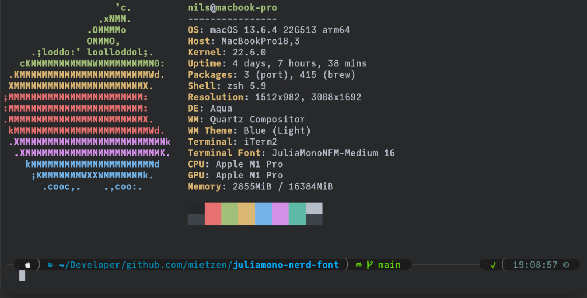

# JuliaMono extended Nerd-Fonts edition

This is a the beautiful [JuliaMono](https://github.com/cormullion/juliamono) font by Cormullion extended via fontforge (aka [Nerd Fonts Patcher](https://github.com/ryanoasis/nerd-fonts#font-patcher)) with all single width glyphs from the Nerd Fonts project.

The download contains four variants of the font, which differ as follows:

- The `Forced` suffix indicates that _all_ Nerd Fonts glyphs are included, which means that a small number of non-standard JuliaMono glyphs are replaced. Conversely the non-`Forced` variants lack a small number of Nerd Fonts glyphs, but retain all JuliaMono glyphs. **If you see a superscript or subscript character where you would expect a Nerd Fonts icon, try using a `Forced` variant.** See mietzen/juliamono-nerd-font#17 and cormullion/juliamono#231 for details.
- The `Mono` suffix indicates that all glyphs are scaled down to fit within the "standard cell" of the monospaced font. This is required for compatibility with certain terminals and editors. In the non-`Mono` variants, the Nerd Fonts icons are their normal size and often overlap with the following cell. Many terminals and editors have no problem with this (just add a space after the icon to avoid overlapping characters).

**Feel free to fork and modify!**

### [Download](https://github.com/mietzen/juliamono-nerd-font/releases/download/v0.061/fonts.zip)

## Example

>Theme:&nbsp;&nbsp;&nbsp;[romkatv/powerlevel10k](https://github.com/romkatv/powerlevel10k)\
>Color:&nbsp;&nbsp;&nbsp;&nbsp;&nbsp;&nbsp;base16_edge-dark by: [chriskempson/base16-shell](https://github.com/chriskempson/base16-shell)

